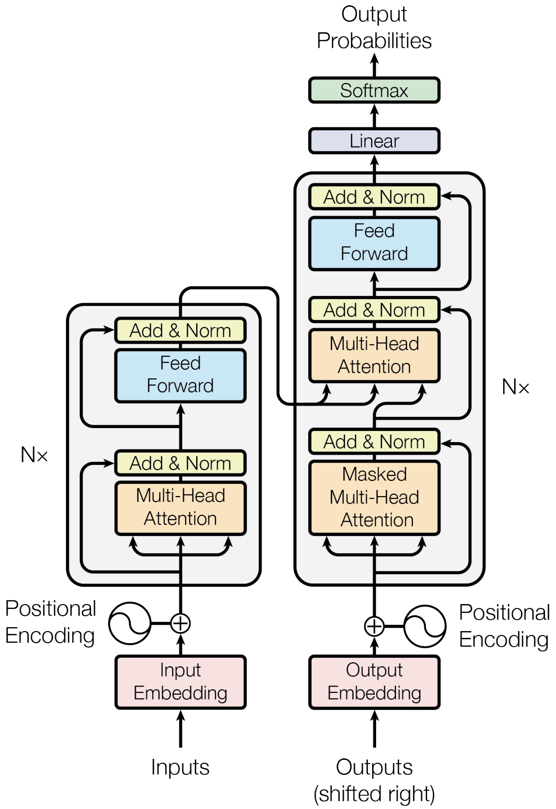

# Redesign of Efficient Transformers
#### Contributor(s): yukingx@gmail.com (I am interested in variants of the Vision Transformer)

### ** Transformer **
<!--

-->

### ** Goals 🚀 **
✅ Understand the concept of Attention, Self-Attention, and Multi-Head Attention.  
☑️ Understand the concpet of Key, Query, and Value.  
☑️ Understand the concpet of Positional Encoding.  
☑️ Understand the concpet of Encoder and Decoder.  
☑️ Test and Understand a training process of the original transformer at the code level.  
☑️ Design and Implement a parallelized transformer block of the encoder.  
☑️ Design and Implement a simplified transformer block of the encoder.  
<!--
☑️ Design and Implement a PA-Former, Parallel Transformer with Adaptively Shaped Attention  
☑️ Write and Submit PA-Former to AI Conferences such as ICPR 2024, ACCV 2024, etc.  
-->

### ** Papers📄 **  

### *** GPT Implementation: **
☑️ [It's GPT Time!](https://medium.com/@kdwa2404/gpt-with-andrej-karpathy-part-1-865bec6fbcce)  
☑️ [Optimize!](https://medium.com/@kdwa2404/gpt-with-andrej-karpathy-part-2-f8653926272f)  
☑️ [Attention!](https://medium.com/@kdwa2404/gpt-with-andrej-karpathy-part-3-a42313db1421)  
☑️ [Attention is all you need!](https://medium.com/@kdwa2404/gpt-with-andrej-karpathy-part-4-319365968713)  
☑️ [Transformer Networks](https://medium.com/@kdwa2404/gpt-with-andrej-karpathy-part-5-d5c0cbfec7de)  
☑️ [Karpathy's Original Video: Let’s Build GPT: from scratch, in code, spelled out](https://www.youtube.com/watch?v=kCc8FmEb1nY&t=20s)  

### ** Related GitHub Works: **
🌐 [Transformers](https://github.com/huggingface/transformers) - A Collection of State-of-Arts Transformers with HuggingFace Code Links
☑️ Add more repositories.  

### ** Articles: **
☑️ [[AI] A Comprehensive Review of Transformers: from BERT to ChatGPT](https://medium.com/@vlad_zh/a-comprehensive-review-of-transformers-from-bert-to-chatgpt-f7dfe2b23043)  
☑️ [The Annotated Transformer](https://nlp.seas.harvard.edu/2018/04/03/attention.html) - Code Based Explanation (So Good for Newbies!)  
☑️ Vision Transformer (ViT)  
☑️ GPT 2: [It's GPT Time!](https://lnkd.in/gAAiWe3q) => [Optimize!](https://lnkd.in/gYVUq7e7) => [Attention!](https://lnkd.in/gFqEyiC8) => [Attention is all you need!](https://lnkd.in/gsRAH_cY) => [Transformer Networks](https://lnkd.in/gBmNKyrz)  
☑️ [Transformer Details Not Described in The Paper](https://tunz.kr/post/4)    
☑️ [Transformer, GPT-3,GPT-J, T5 and BERT.](https://aliissa99.medium.com/transformer-gpt-3-gpt-j-t5-and-bert-4cf8915dd86f)    
☑️ [Beyond Token Prediction: the post-Pretraining journey of modern LLMs](https://amatriain.net/blog/postpretraining)    
☑️ [Understanding the Neural Tangent Kernel](https://rajatvd.github.io/NTK/)  
☑️ [Mixture-of-Experts (MoE): The Birth and Rise of Conditional Computation](https://cameronrwolfe.substack.com/p/conditional-computation-the-birth) 
☑️ Add more articles.  
<!-- 
Korean::  
☑️ [Large Language Model (1) : Foundation Model](https://jins-sw.tistory.com/48)  
☑️ [Large Language Model (2) : LLM을 가능케한 삼박자](https://jins-sw.tistory.com/49)  
☑️ [Large Language Model (3) : In-Context Learning, 남은 이야기들](https://jins-sw.tistory.com/51)  
☑️ [BERT 논문정리](https://tmaxai.github.io/post/BERT/)  
☑️ Add more articles.  
☑️ [셀프 어텐션 동작 원리](https://ratsgo.github.io/nlpbook/docs/language_model/tr_self_attention/)
- https://github.com/ndb796/Deep-Learning-Paper-Review-and-Practice?tab=readme-ov-file 
✅ [생각의 사슬(Chain-of-Thought) 프롬프트를 사용하여 추론 작업의 성능 높이기](https://www.ncloud-forums.com/topic/63/)
-->

### ** Videos: **
☑️ [Karpathy's Video: Let’s Build GPT: from scratch, in code, spelled out](https://www.youtube.com/watch?v=kCc8FmEb1nY&t=20s)  
☑️ [New KOALA LLM - Ignite Your Professional Career in AI](https://www.youtube.com/watch?v=ePoCYL_5rDM)
<!-- 
Korean:  
☑️ [[딥러닝 기계 번역] Transformer: Attention Is All You Need (꼼꼼한 딥러닝 논문 리뷰와 코드 실습)](https://www.youtube.com/watch?v=AA621UofTUA)
-->

### ** Free Books: **
<!-- 
Korean:
☑️ [딥 러닝을 이용한 자연어 처리 입문](https://wikidocs.net/book/2155) - Transformer Fundamentals for NLP (Korean Only)
- (TensorFlow) https://github.com/ukairia777/tensorflow-nlp-tutorial
- (PyTorch) https://wikidocs.net/book/2788
- (Slides) https://www.slideshare.net/wonjoonyoo/ss-188835227
☑️ [PyTorch로 시작하는 딥 러닝 입문](https://wikidocs.net/book/2788) - See the parts of NLP (Korean Only)
-->

### ** Implementation **
I plan to apply these tools for my implementation:  
✅ PyTorch, Conda, GPU Server with A5000 x 8, tmux for session management  
<!--
Korean:
☑️ [WandB 를 활용하여 모델의 학습을 추적하는 방법](https://teddylee777.github.io/machine-learning/wandb/)  
-->
